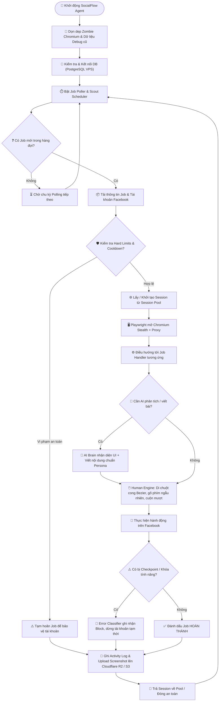

# Mindmap Cách Hoạt Động & Công Nghệ Sử Dụng - SocialFlow Agent

## 1. Sơ Đồ Tư Duy Hệ Thống (System Architecture Map)

```mermaid
graph TD
    %% Root
    ROOT(["🚀 SOCIALFLOW AGENT"])

    %% Core Architecture
    subgraph S1["🏗️ Core Architecture"]
        direction TB
        S1_ENTRY["Entry Points<br/>• Electron Desktop GUI<br/>• CLI Mode (cli.js / agent.js)<br/>• Background Poller Daemon"]
        S1_PROC["Process Management<br/>• Zombie Chromium Cleanup<br/>• Debug Storage Cleaner<br/>• Crash & Lifecycle Control"]
    end

    %% Browser Automation
    subgraph S2["🌐 Browser Automation & Stealth"]
        direction TB
        S2_PLAY["Playwright Stealth Core<br/>• Bundled Chromium (ms-playwright)<br/>• Persistent Profiles (.socialflow/profiles)<br/>• Custom User-Agents & Fingerprints<br/>• Proxy Support (HTTP/SOCKS5)"]
        S2_HUMAN["Human Emulation Engine<br/>• Bezier Curve Mouse Movements<br/>• Organic Typing Speed Variations<br/>• Natural Scrolling & Jitter Delays"]
        S2_POOL["Session Pool Manager<br/>• Cookie & Context Persistence<br/>• Session Reuse & Warmup<br/>• RAM & Process Optimization"]
    end

    %% AI & Intelligence
    subgraph S3["🧠 AI & Intelligence Engine"]
        direction TB
        S3_BRAIN["AI Brain<br/>• Vision UI Element Recognition<br/>• Multi-step Action Planning<br/>• Dynamic Prompt Execution"]
        S3_CONTENT["AI Content & Comment<br/>• Contextual Post Analysis<br/>• Persona Style Matching<br/>• Multi-turn Reply Generator"]
        S3_FILTER["AI Filter & Memory<br/>• Target Group & Post Filtering<br/>• Interaction History Memory<br/>• KPI & Reach Booster"]
    end

    %% Job Scheduling
    subgraph S4["⚙️ Job Scheduling & 26+ Handlers"]
        direction TB
        S4_POLL["Poller & Scheduler<br/>• DB Task Queue Pulling<br/>• Priority & Concurrency Lock<br/>• Scout Scheduler"]
        S4_HANDLERS["Handlers Types<br/>• Nurture Feed & Campaigns<br/>• Auto Post (Profile/Group/Page)<br/>• Auto Comment & Reply<br/>• Group Scanner & Auto Join<br/>• Friend Request & Opportunity React<br/>• Account Health Check"]
    end

    %% Safety & Anti-Ban
    subgraph S5["🛡️ Safety & Anti-Ban System"]
        direction TB
        S5_LIMIT["Hard Limits Engine<br/>• Daily Action Caps (Comment/Post/Friend)<br/>• Minimum Cooldown Timers"]
        S5_BLOCK["Risk & Error Management<br/>• Checkpoint & Block Detection<br/>• Automatic Backoff & Error Classifier<br/>• Randomized Delays & Jitter"]
    end

    %% Data & Sync
    subgraph S6["💾 Data & Infrastructure"]
        direction TB
        S6_DB["Database & Sync<br/>• PostgreSQL Direct (pg) — VPS<br/>• Fallback HTTP DB Client (VPS API)<br/>• Remote Hermes VPS Client"]
        S6_STORAGE["Cloud Storage<br/>• Cloudflare R2 / AWS S3<br/>• Activity Logs & Screenshots"]
    end

    %% Connections
    ROOT --> S1
    ROOT --> S2
    ROOT --> S3
    ROOT --> S4
    ROOT --> S5
    ROOT --> S6
```

---

## 2. Luồng Hoạt Động Chi Tiết (Execution Lifecycle Flowchart)

---

## 3. Bảng Tổng Hợp Công Nghệ Sử Dụng (Technology Stack)

| Hạng mục | Công nghệ / Thư viện | Vai trò & Mục đích sử dụng |
| :--- | :--- | :--- |
| **Core Runtime & Shell** | **Node.js (v18+)** | Môi trường thực thi JavaScript phía backend cho Agent. |
| **Desktop Application** | **Electron (v33.4+)** | Xây dựng giao diện ứng dụng Desktop (GUI) chạy đa nền tảng (Windows/macOS/Linux). |
| **Build & Packaging** | **electron-builder**, **@electron/packager** | Đóng gói ứng dụng thành file cài đặt Windows (.exe/NSIS), macOS (.dmg), Linux (.AppImage). |
| **Browser Automation** | **Playwright (v1.49+)** | Tự động hóa trình duyệt Chromium, tương tác DOM, lấy screenshot, quản lý tab. |
| **Browser Engine** | **Chromium (ms-playwright)** | Trình duyệt Chromium được đóng gói sẵn đi kèm agent để đảm bảo tính đồng nhất môi trường. |
| **Anti-Detect & Stealth** | **Custom Stealth Scripts & Session Pool** | Giả lập User-Agent, canvas fingerprint, timezone, screen resolution, lưu trữ cookies/profile riêng biệt tại `.socialflow/profiles`. |
| **Human Emulation** | **Human Behavior Engine (Vanilla JS)** | Mô phỏng đường di chuyển chuột đường cong Bezier, gõ phím tốc độ ngẫu nhiên, cuộn trang tự nhiên, độ trễ giả lập người dùng thật. |
| **Network & Proxy** | **https-proxy-agent**, **axios**, **ws** | Quản lý kết nối Proxy (HTTP/HTTPS/SOCKS5) per-account, giao tiếp API RESTful và WebSocket. |
| **Database Systems** | **PostgreSQL VPS (`pg`)** trực tiếp, fallback HTTP qua VPS API | Lưu trữ chính dữ liệu tài khoản, chiến dịch, danh sách nhóm, lịch trình jobs và nhật ký hoạt động. Đã bỏ Supabase. |
| **Database Fallback** | **Custom HTTP DB Client (`lib/http-db.js`)** | Cơ chế dự phòng truy vấn DB qua HTTP API khi kết nối trực tiếp PostgreSQL bị chập chờn/chặn. |
| **Distributed Agent Sync**| **Hermes VPS Client (`lib/hermes-client.js`)** | Đồng bộ trạng thái và nhận lệnh từ máy chủ trung tâm VPS Hermes. |
| **Cloud Storage** | **Cloudflare R2 / AWS S3 (`@aws-sdk/client-s3`)** | Lưu trữ và phân phối các tệp truyền thông (hình ảnh, video bài đăng, ảnh chụp màn hình debug/báo cáo). |
| **AI & Vision Engine** | **OpenAI / Claude / Gemini API Integrations** | Phân tích bài viết, nhận diện bố cục giao diện (Vision), tạo bình luận tự nhiên theo Persona, quét và lọc nhóm bài viết tiềm năng. |
| **Security & Safety** | **Hard Limits Engine**, **Block Detector**, **bcryptjs** | Giới hạn số lượng hành động/ngày, phát hiện checkpoint/banned tự động, mã hóa thông tin nhạy cảm. |
| **Task Management** | **Job Poller Engine**, **Scout Scheduler** | Quản lý hàng chờ tác vụ, lập lịch quét bài viết/nhóm tự động, điều phối 26+ handlers xử lý bài đăng, bình luận, kết bạn, nuôi nick. |

---

## 4. Phân Tích Chi Tiết Các Phân Hệ Hoạt Động (Detailed Subsystems)

### 4.1. Phân Hệ Trình Duyệt & Anti-Detect Browser Pool (`browser/`)
- **`launcher.js`**: Khởi chạy Chromium với các tham số chống phát hiện (stealth), cấu hình Proxy riêng cho từng tài khoản, chỉ định thư mục lưu trữ profile độc lập (`.socialflow/profiles/{account_id}`).
- **`session-pool.js`**: Duy trì pool trình duyệt để tái sử dụng tab/context, tránh việc mở/đóng trình duyệt liên tục gây tốn CPU/RAM và giảm nguy cơ bị Facebook nghi ngờ.
- **`human.js`**: Tạo các thao tác di chuột ngẫu nhiên (Bezier curves), nhấn phím có độ trễ thay đổi, cuộn trang từng bước có jitter để giả lập 100% hành vi thao tác của người thật.

### 4.2. Phân Hệ AI & Trí Tuệ Nhân Tạo (`lib/ai-*.js`)
- **`ai-brain.js`**: Bộ não điều khiển trung tâm, đưa ra quyết định đa bước (multi-step planning), phân tích ảnh screenshot giao diện để nhận diện các nút bị ẩn hoặc thay đổi giao diện từ Facebook.
- **`ai-comment.js`**: Sinh nội dung bình luận chuẩn ngữ cảnh, tự động đa dạng hóa văn phong theo Persona được chỉ định, tránh trùng lặp nội dung gây đánh dấu Spam.
- **`ai-filter.js` & `ai-memory.js`**: Lọc nhóm/bài viết theo từ khóa mục tiêu và lưu nhớ lịch sử tương tác để không lặp lại hành động trên cùng một bài viết nhiều lần.

### 4.3. Phân Hệ Quản Lý Tác Vụ & Xử Lý Chiết Cành (`jobs/`)
- **`poller.js`**: Liên tục quét cơ sở dữ liệu để nhận các `job` cần thực thi (trạng thái `pending`).
- **`handlers/` (26+ Handlers)**:
  - *Chăm sóc & Tương tác*: `campaign-nurture.js`, `nurture-feed.js`, `campaign-interact-profile.js`, `campaign-opportunity-react.js`
  - *Đăng bài*: `campaign-post.js`, `post-group.js`, `post-page.js`, `post-profile.js`
  - *Bình luận*: `comment-post.js`
  - *Quét & Thám sát*: `scan-group.js`, `scan-group-feed.js`, `campaign-discover-groups.js`, `fetch-pages.js`, `fetch-groups.js`
  - *Thành viên & Kết bạn*: `join-group.js`, `campaign-send-friend-request.js`, `check-group-membership.js`
  - *Sức khỏe tài khoản*: `check-health.js`, `check-engagement.js`

### 4.4. Phân Hệ An Toàn & Chống Khóa Tài Khoản (`lib/`)
- **`hard-limits.js`**: Kiểm soát các ngưỡng an toàn tối đa (ví dụ: tối đa N comment/ngày, độ trễ tối thiểu giữa các bài viết).
- **`block-detector.js` & `error-classifier.js`**: Theo dõi phản hồi từ giao diện Facebook. Khi phát hiện từ khóa "Tài khoản bị hạn chế", "Xác minh danh tính", "Bình luận quá nhanh", hệ thống lập tức tạm dừng job và gắn cờ cảnh báo tài khoản.
- **`randomizer.js`**: Bơm độ nhiễu ngẫu nhiên vào mọi khoảng thời gian chờ (delay jitter) và thứ tự thực hiện hành động.
