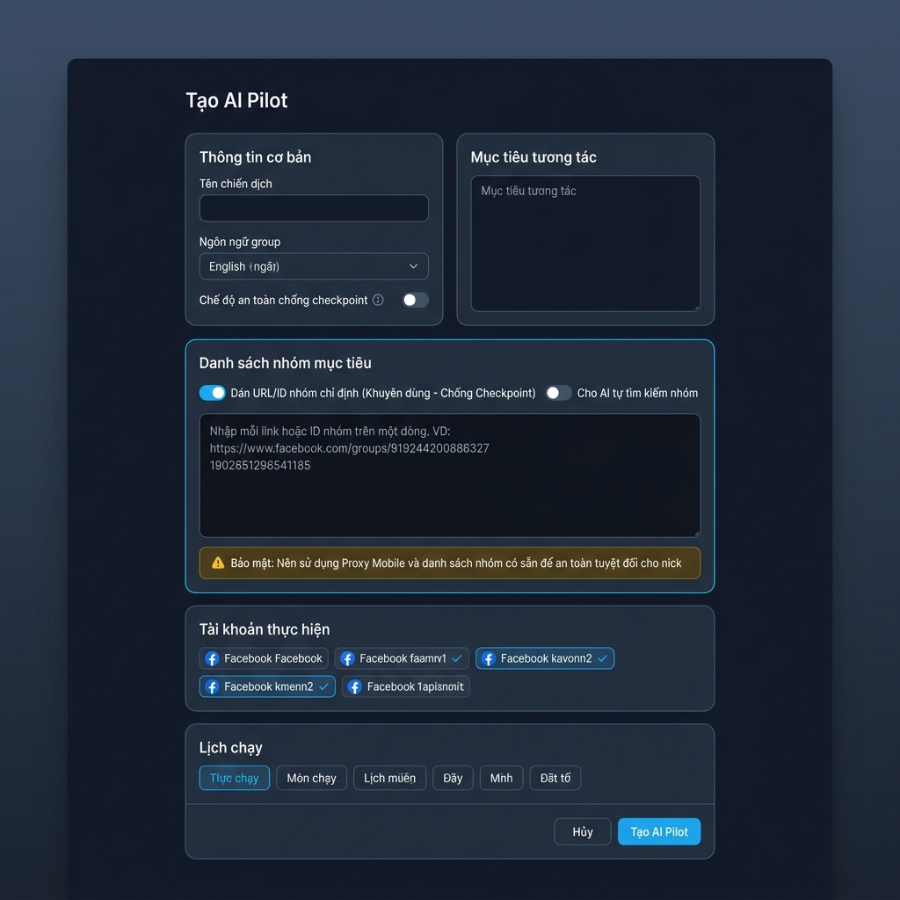
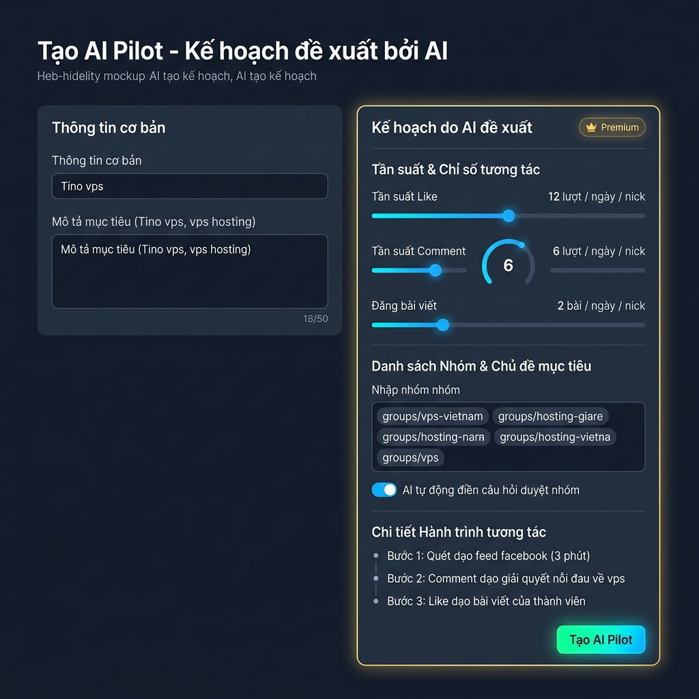
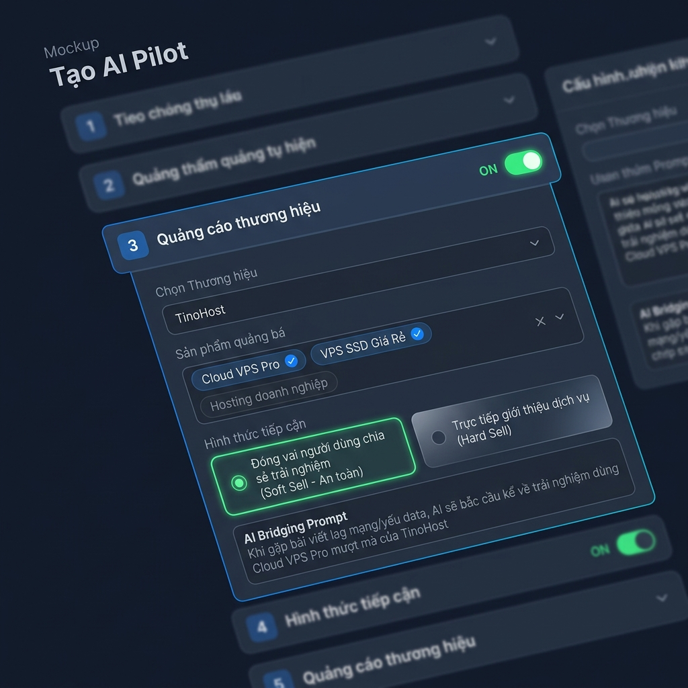
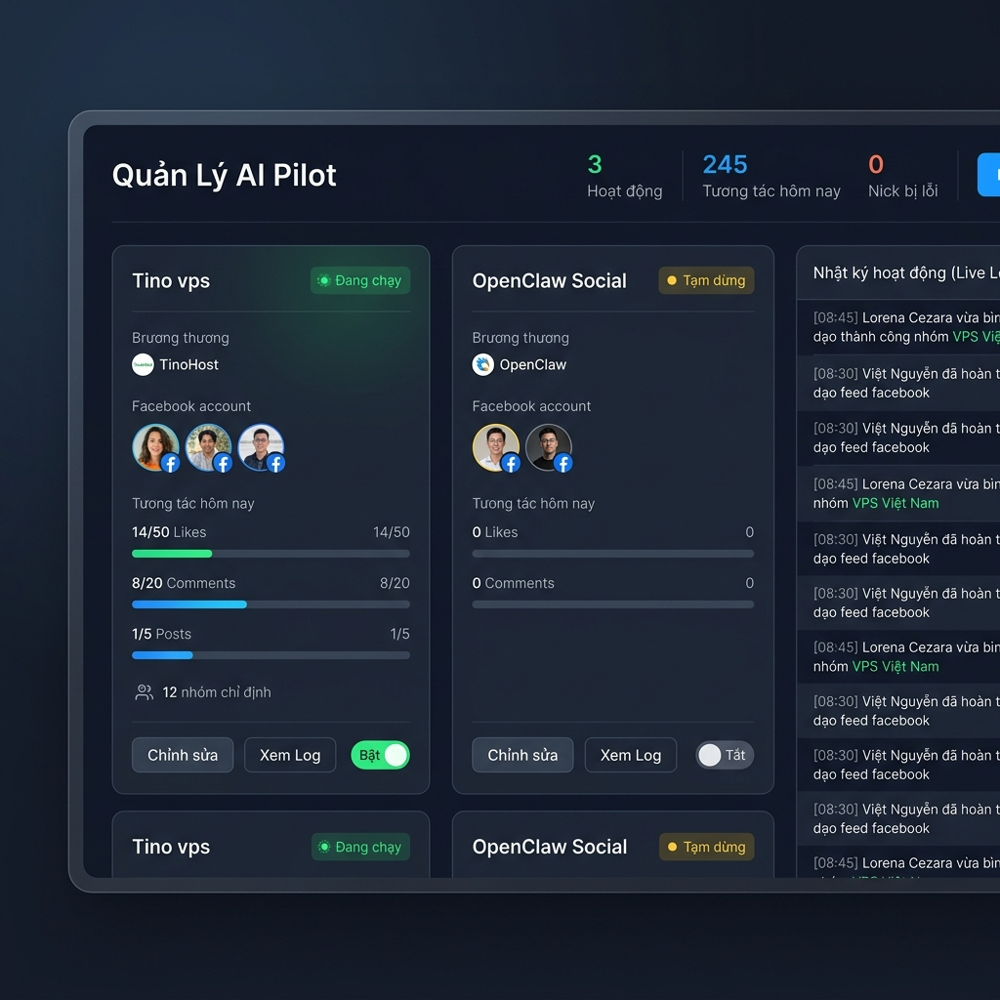

# Bản thiết kế đề xuất: Giao diện hệ thống "AI Pilot" toàn diện

Bản thiết kế này cấu trúc lại hoàn toàn giao diện Frontend của phần **"Tạo AI Pilot"** và **"Trang Quản Lý AI Pilot"** để khớp 100% với hệ thống Backend, database Supabase, và động cơ Local Agent mới nâng cấp.

---

## 📸 Hình ảnh thiết kế giao diện đề xuất (Mockup UI)

Chúng tôi đã dựng 4 trạng thái thiết kế giao diện mới (Premium Dark Mode) để bạn tiện xem:

* **Trạng thái 1 (Nhập thông tin & Dán danh sách nhóm chỉ định):**
  

* **Trạng thái 2 (Kế hoạch & Tần suất tương tác chi tiết do AI đề xuất):**
  

* **Trạng thái 3 (Mở rộng mục Quảng cáo thương hiệu & Chọn sản phẩm):**
  

* **Trạng thái 4 (Trang Quản Lý AI Pilot - Management Dashboard):**
  

---

## 🛠️ Các cải tiến cốt lõi trong giao diện mới

### 1. Bổ sung mục "Danh sách nhóm mục tiêu" (Target Groups)
* **Giao diện:**
  * Thẻ chọn chuyển đổi (Segmented Control) giữa: **"Dán URL/ID nhóm chỉ định"** (Mặc định - Khuyên dùng) và **"Cho AI tự quét nhóm"** (Có cảnh báo).
  * Một ô **Textarea lớn** để người dùng dán danh sách nhóm:
    `https://www.facebook.com/groups/919244200886327`
    `1902651296541185`

### 2. Trình duyệt Kế hoạch & Tần suất tương tác do AI Đề xuất (AI-Proposed Settings Panel)
Khi người dùng nhập yêu cầu và nhấn **"AI tạo kế hoạch"**, hệ thống sẽ hiển thị thông số đề xuất bằng thanh trượt (slider):
* **Tần suất & Ngân sách tương tác chi tiết (Interaction Budgets):**
  * **Thanh trượt Tần suất Like:** (AI đề xuất ví dụ: `12 lượt / ngày / nick`).
  * **Thanh trượt Tần suất Comment:** (AI đề xuất ví dụ: `6 lượt / ngày / nick`).
  * **Thanh trượt Tần suất Đăng bài:** (AI đề xuất ví dụ: `2 bài / ngày / nick`).
* **Hành trình tương tác của Pilot (Interactions Journey Timeline):** Hiển thị trình tự buoc chạy (Quét feed -> Tìm cơ hội -> Bình luận Quality Gate -> Thích bài viết).

### 3. Mục mở rộng "Quảng cáo thương hiệu" khi BẬT (Brand Ads Expanded Section)
Khi bật công tác `Quảng cáo thương hiệu`, giao diện mở rộng ra các trường:
* **Dropdown "Chọn Thương hiệu" (Select Brand):** Chọn thương hiệu (Ví dụ: `TinoHost`).
* **Hộp nhập/chọn "Sản phẩm quảng bá" (Select Products):** Chọn các sản phẩm/gói cước muốn quảng cáo có tích xanh (Ví dụ: `Cloud VPS Pro`, `VPS SSD Giá Rẻ`).
* **Cấu hình "Hình thức tiếp cận" (Approach Style):**
  * **Đóng vai chia sẻ trải nghiệm (Soft Sell - Khuyên dùng):** AI tự động kể chuyện trải nghiệm bắc cầu tự nhiên, tránh spam thô lỗ gây checkpoint.
  * **Trực tiếp giới thiệu dịch vụ (Hard Sell).**
* **Hộp gợi ý bắc cầu (AI Bridging Prompt Preview):** Hiển thị trực quan ví dụ cách AI sẽ nói để người dùng dễ hình dung.

### 4. Trang Quản Lý AI Pilot (AI Pilot Management Dashboard)
Trang tổng hợp quản lý toàn bộ các chiến dịch AI Pilot đang chạy của bạn:
* **Khung thông số tổng quan (Metrics bar):** Hiển thị nhanh: `3 Chiến dịch Hoạt động`, `245 Tương tác hôm nay`, `0 Nick bị lỗi`.
* **Lưới danh sách AI Pilot (Campaign Grid):** Mỗi ô là một chiến dịch với các thông tin:
  * **Status Badge:** `Đang chạy` (Chấm xanh nhấp nháy) hoặc `Tạm dừng` (Chấm xám).
  * **Tài khoản thực hiện:** Ảnh avatar của các nick Facebook đang chạy chiến dịch đó.
  * **Tiến độ tương tác trong ngày:** Thanh tiến độ (Progress bar) thể hiện thực tế: `Likes: 14/50`, `Comments: 8/20`, `Posts: 1/5`.
  * **Thiết lập nhanh:** Nút gạt **Bật/Tắt** nhanh chiến dịch, nút **Chỉnh sửa** và nút **Xem Log** của từng chiến dịch.
* **Bảng Nhật ký hoạt động thời gian thực (Real-time Live Logs):**
  * Hiển thị cuộn chuỗi log thực tế đang diễn ra từ Local Agent truyền về cơ sở dữ liệu giúp bạn kiểm soát 100% hoạt động:
    `[08:45] Lorena Cezara vừa bình luận dạo thành công nhóm VPS Việt Nam`
    `[08:30] Việt Nguyễn đã hoàn thành dạo feed facebook`

---

## 🚀 Lợi ích đối với sản phẩm
1. **Kiểm soát chặt chẽ:** Biểu đồ và thanh tiến độ trong ngày giúp bạn theo dõi ngay xem bot có làm việc quá giờ, có quá tải hoặc sắp bị checkpoint hay khong.
2. **Bật/Tắt nhanh chóng:** Tích hợp công tắc ON/OFF giúp bạn can thiệp ngay lập tức nếu phát hiện bất kỳ sự cố nào.
3. **Kinh doanh hiệu quả:** Thấy rõ hiệu suất của các Pilot mang về bao nhiêu tương tác thực tế.
